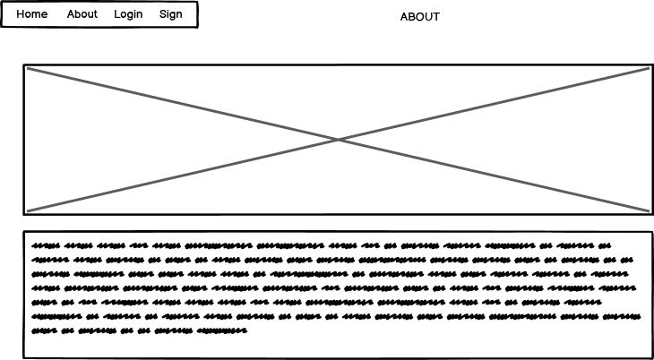

# Art Criticism - Django Website

Welcome to the Art Criticism Django website! This platform allows users to upload artwork, write critiques about the artworks, and comment on other users' critiques. The website includes features such as user authentication, an admin page, and an about page.

## Responsive

## Color scheme

## Features

- **User Authentication**: Users can sign up, log in, and log out securely.
- **Artwork Upload**: Users can upload their artworks to the platform.
- **Critiques**: Users can write critiques about the uploaded artworks.
- **Comments**: Users can comment on the critiques written by others.
- **Admin Page**: Admins can manage users, artworks, and critiques.
- **About Page**: Provides information about the website and its purpose.
- **Search Functionality**: Users can search for posts and post content.

## Usage
- **Sign Up/Login**: Create an account or log in using your credentials.
- **Upload Artwork**: Navigate to the upload page and submit your artwork.
- **Write Critiques**: View the artwork and write your critique.
- **Comment**: Leave comments on the critiques of other users.
- **Admin Page**: Access the admin interface at http://127.0.0.1:8000/admin/ to manage the content.
- **Search Posts**: Use the search bar to find posts and post content.

## About
This platform was created to provide a space for artists and art enthusiasts to share and critique artworks. Our goal is to foster a supportive and constructive community where everyone can grow and improve their artistic skills.

## User Story: Upload and Critique Artwork
Title: As a registered user, I want to upload my artwork and write a critique so that I can receive feedback from other users.

## Description
A user has recently joined the Art Criticism Django website to share their artworks and improve their artistic skills through constructive feedback. They want to upload one of their artworks and write a critique about it to start a discussion and receive comments from other users.

## Acceptance Criteria
**User Registration and Authentication**:
- The user can sign up for a new account by providing a username, email, and password.
- The user can log in to their account using their credentials.
- The user can log out from their account securely.

**Upload Artwork**:
- The user can navigate to the "Upload Artwork" page from the main menu.
- The user can select an image file of their artwork from their computer.
- The user can add a title and description for their artwork.
- The user can submit the artwork, and it gets displayed on the platform.

**Write Critique**:
- The user can view their uploaded artwork on the platform.
- The user can write a detailed critique about their artwork, highlighting their thoughts and techniques used.
- The user can submit the critique, and it gets associated with their artwork.

**Comment on Critiques**:
- Other users can view the user's artwork and read their critique.
- Other users can leave comments on the user's critique, providing feedback and suggestions.

**Admin Management**:
- An admin can log in to the admin page.
- The admin can manage users, artworks, and critiques.

**Search Posts**:
- Users can search for posts and post content using the search bar.
- The search results display posts that match the search query in the title or content.

**About Page**:
- The user can visit the "About" page to learn more about the website's purpose and community guidelines.

## Scenario
The user navigates to the website and signs up for a new account. After verifying their email and logging in, the user visits the "Upload Artwork" page. The user uploads an image of their artwork, adds a title and description, and submits it. The artwork gets displayed on the platform, and the user writes a detailed critique about it. Other users view the user's artwork, read their critique, and leave comments with feedback. The user reads the comments and engages in a discussion to improve their artistic skills.

By following this user story, the user is able to share their artwork, receive constructive feedback from the community, and participate in meaningful discussions to enhance their art.

## Wireframes

# Testing

## Lighthouse

## License
This project is licensed under the MIT License. See the LICENSE file for more details.
