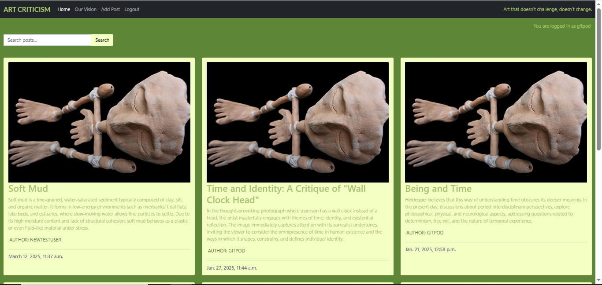
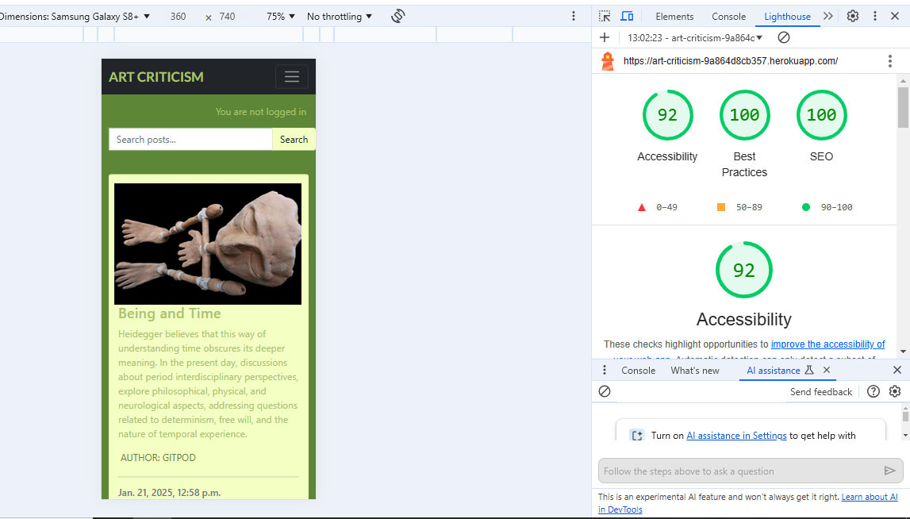

# Art Criticism - Django Website

Welcome to the Art Criticism Django website! This platform allows users to write critiques about an artworks and comment on other users' critiques. The website includes features such as user authentication, an admin page, and an about page.

# UX Design Process
# Wireframes

## Desktop

## Mobile

## Responsive

## Color scheme

## Features

- **User Authentication**: Users can sign up, log in, and log out securely.
- **Critiques**: Users can write critiques about an artwork.
- **Comments**: Users can comment on the critiques written by others.
- **Admin Page**: Admins can manage users, artworks, and critiques.
- **About Page**: Provides information about the website and its purpose.
- **Search Functionality**: Users can search for posts and post content.

## Usage
- **Sign Up/Login**: Create an account or log in using your credentials.
- **Write Critiques**: Write your critique.
- **Comment**: Leave comments on the critiques of other users.
- **Admin Page**: Access the admin interface at https://websiteaddress/admin/ to manage the content.
- **Search Posts**: Use the search bar to find posts and post content.

## About
This platform was created to allow artists and art enthusiasts to write critiques. We aim to foster a supportive and constructive community where everyone can grow and improve their artistic skills.

## User Story: Upload and Critique Artwork
Title: As a registered user, I want to write a critique so that I can receive feedback from other users.

## Description
A user has recently joined the Art Criticism Django website to write critiques and improve their artistic skills through constructive feedback. They want to write a critique about it to start a discussion and receive comments from other users.

## Acceptance Criteria
**User Registration and Authentication**:
- The user can sign up for a new account by providing a username, email, and password.
- The user can log in to their account using their credentials.
- The user can log out from their account securely.

**Write Critique**:
- The user can write a detailed critique about an artwork, highlighting their thoughts and techniques used.
- The user can submit the critique, and it gets associated with their artwork.

**Comment on Critiques**:
- Other users can view the user's critique.
- Other users can leave comments on the user's critique, providing feedback and suggestions.

**Admin Management**:
- An admin can log in to the admin page.
- The admin can manage users and critiques.

**Search Posts**:
- Users can search for posts and post content using the search bar.
- The search results display posts that match the search query in the title or content.

**About Page**:
- The user can visit the "About" page to learn more about the website's purpose and community guidelines.

## Scenario
The user navigates to the website and signs up for a new account. After verifying their email and logging in, the user can write a critique of an artwork, add a title and description, and submit it. Other users view the user's critique and leave comments with feedback. The user read the comments and engage in a discussion to improve their artistic skills.

By following this user story, the user can share their ideas, receive constructive feedback from the community, and participate in meaningful discussions to enhance their art.

## AI Implementation and Orchestration

# Django Web App Project: AI-Assisted Development Journey

## Overview

This project utilized AI tools like MS Copilot, GitHub Copilot, and Adobe AI  to plan, develop, and optimize a Django web app suitable for beginner developers. With a two-week timeframe, these tools significantly streamlined brainstorming, coding, debugging, and testing.

---

## Planning

- **Brainstorming**: MS Copilot suggested more than 30 Django web-app ideas. After selecting a project and defining goals, I used Copilot to create user stories, acceptance criteria, and tasks.

- **Database Design**: Perplexity AI provided a database schema.

- **Implementation Ideas**: GitHub Copilot in VS Code offers ideas tailored for developers.
---

## Code Generation

- **Coding Assistance**: Using GitHub Copilot, I converted pseudocode prompts into code snippets. These were reviewed and refined to meet project requirements.

- **Bootstrap Components**: Copilot sped up the creation of elements like the navbar and tested for functionality and responsiveness.

- **Reverse Prompting**: Copilot refined its suggestions by engaging in step-by-step discussions and adapting to specific requirements.

---

## Content Creation

- **Text**: MS Copilot generated content for pages like "About" and "Art" themes, requiring minimal edits.
- **Images**: Adobe AI produced the About page images.

---

## Debugging

- **Code Fixes**: GitHub Copilot debugged issues through inline prompts and workspace-wide context, suggesting fixes and explaining inconsistencies.

- **DevTools**: Chrome DevTools AI Assistance explained Console errors, expediting resolutions.

---

## Performance & Testing

- **Class-Based Views**: Copilot optimized views while maintaining the original code for comparison.
- **Automated Testing**: Copilot suggested test skeletons, edge cases, and fixes, ensuring functionality and integrity.

---

## Workflow Impact

This project showcased the power of AI in accelerating development, enabling a developer to brainstorm, code, and debug efficiently. The copilot served as a valuable pair programmer throughout the process.

## Deployment
- **Platform:** [Platform used: Heroku - https://art-criticism-9a864d8cb357.herokuapp.com/]

## Most important data structure

## Testing Summary

- **Manual Testing:**
  - **Devices and Browsers Tested:** [Desktop: Edge, Chrome OK, Mobile: Samsung OK, Tablet: Safari OK]
  - **Features Tested:** [Tested manually, CRUD operations, navigation OK]
  - **Results:** ["All critical features worked as expected, including accessibility checks."]

- **Automated Testing:**

  ## Tools Used: 
  
  - Django TestCase OK

  - Lighthouse

##

  - CSS validator w3

  - HTML validator w3

## License
This project is licensed under the MIT License. See the LICENSE file for more details.
